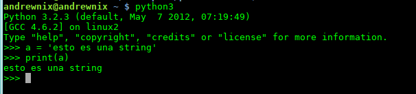

# Introduccion a   Andres F. Cardenas #

---

# Me presento #
## Andres F. Cardenas ##
## Desarrollador web Python/Django ##
### akardenasjimenez@gmail.com ######
### @andresfcardenas ######

---

# Motivos para dar esta charla #
1. Mostrar una excelente alternativa para el desarrollo de software
2. Demostrar que es una herramienta robusta
3. Aclarar mitos que giran entorno a este lenguaje
4. Dos meetups en Bogotá:

    * Python Colombia - http://www.meetup.com/pythoncolombia-bogota/

    * Django Bogotá - http://www.meetup.com/Django-Bogota/

---

# ¿Que no es esta charla? #

---

# ¿Que es Python? #

---

# Guido van Rossum  #

---

# Caracteristicas #
* Sintaxis clara y limpia -> Codigo legible
* Lenguaje interpretado (Practico para hace scripts)
* Flexible
* Veloz (En comparacion con otros lenguajes interpretados)
* Tipado dinamico
* Fuertemente tipado
* Multiplataforma de verdad
* Multiparadigma: estructurado, funcional, orientado a objetos y aspectos
* Se complementa con C/C++ facilmente si se quiere optimizar la app

---

# Por qué Python #
* Cuando se lee codigo Python, se lee como si se tratara de lenguaje natural
* Dinamico al no tener que declarar variables ni argumentos
* Tipos de datos de alto nivel
* Gestion de memoria automatica
* Viene con pilas incluidas
* Facil, En serio, Muy facil de aprender
* Desarrollo rapido de aplicaciones
* Codigo facil de mantener
* Se integra muy bien con metodologias agiles de desarrollo como SCRUM o XP

---

# Un pequeño dato interesante!!! #

---

# Un programador Python es 10 veces mas productivo que un programador Java y 100 veces mas productivo que un programador C  #

---

# Caracteristicas unicas de Python #

---

# El interprete de Python #
El interprete de Python es de las mejores herramientas que puede tener este lenguaje.

En el puedes probar rapidamente codigo, hacer programas desechables, probar funcionalidades del lenguaje... etc.

Se ejecuta en el terminal con el comando 'python' o 'python3' de pendiendo de que version de Python tengas instalada

## Interprete Python 2 ##

## Interprete Python 3 ##

---

# Pequeño ejemplo de la sintaxis #
    !python
    class Player:
        """Esta clase representa un jugador
        """
        def __init__(self):
            self.score = REGULATORY_SCORES[0]

        def modify_score(self,p , other_item=None, printed=True):
            """Modifica el puntaje del jugador
            que se le pasa como parametro.
            """
            if other_item == None:
                self.score = REGULATORY_SCORES[
                    REGULATORY_SCORES.index(self.score) + 1
                ]
            elif other_item > 3 and other_item < 7:
                self.score = REGULATORY_SCORES[other_item]
            if printed:
                print "Player {0} {1}\n".format(p, self.get_score())

        def get_score(self):
            """Retorna el puntaje del jugador
            """
            return self.score

    def game(p1, p2):
        """Esta funcion representa un juego
        """
        while True:
            ...

---

# Tipos de datos y Operadores #

---

# Tipos de datos #
* Int (enteros) = 1, 2, 3
* Float (Numeros de punto flotante) = 3.1, 5.4, 1.0
* Decimal (Numeros de punto flotante mas precisos) = Decimal('0.1428571428571428571428571429')
* Complex (Numero con parte imaginaria) = 2.1 +2.8j
* Str (Cadenas de texto) = 'Cadena de texto'
* List (Listas) = [1, 2, 3]
* Tuple (Tuplas) (1, 2, 3)
* Dict (Diccionarios) = {'clave': 1}
* Bool = (Booleanos) = True

---

# Operadores aritmenticos #
* '+' = Suma
* '-' = Resta
* '*' = Multiplicacion
* ** = Exponente
* / = Division
* // = Division entera
* % = Modulo

---

# Operadores logicos o condicionales #
* 'and' = ¿se cunple a y b?
* 'or' = ¿se cumple a o b?
* 'not' = a = not True --> a seria igual a False
* '==' = ¿Son iguales a y b?
* '!=' = ¿Son diferentes a y b?
* '<' = Menor que
* '>' = Mayor que
* '<=' = Menor o igual que
* '>=' = Mayor o igual que
---

# Estructuras de datos #

---

# Diccionarios #
Tipo de dato nativo en Python similar a la matriz asociativa, en el desarrollo web los diccionarios son muy utiles para crear cadenas json a partir de ellos.

Los diccionarios se diferencian de otras estructuras de datos por estar escampadas en llaves '{ }'.

## Crear un diccionario, imprimirlo e imprimir un valor asociado a el ##
    !python
    d = {'llave 1': 'valor 1', 'llave 2': 2}
    print(d)
    {'llave 1': 'valor 1', 'llave 2': 2}
    print(d['llave 1'])
    valor 1

## Modificar un diccionario ##
    !python
    d['llave 1'] = 'nuevo valor' # Cambiar el valor de una llave
    print(d)
    {'llave 1': 'nuevo valor', 'llave 2': 2}
    print(d['llave 1'])
    nuevo valor
    del(d[llave 1]) # Eliminando el valor de un diccionario
    print(d)
    {'llave 2': 2}

---

# Listas #
Las listas son un tipo de dato muy flexible.

Una lista es muchisimo mas que un array en Java, aunque puede usarse como array si eso es lo que realmente quieres.

Una lista puede contener objetos arbitrarios y expandirse de forma dinamica segun se añaden nuevos elementos.

Las listas a diferencia de los diccionarios se distinguen por estar escampadas entre corchetes '[ ]'.

    !python
    lista = [1, {'k': 'v'}, 3, "hola", 3.6, [1, 2, 3], True]
    print(lista[0])

## ¿Que se puede hacer con las listas? ##

* Agregar elementos.
* Particionarlas.
* Se pueden buscar valores.
* Borrar elementos con remove() y pop() y muchisimas cosas mas!!!

---

# Tuplas #
Las tuplas son una estructura de datos inmutable, en pocas palabras, una tupla no puede cambiar una vez sea creada.

Las tuplas a diferencia de las listas y los diccionarios se declaran con parentesis '( )'.

    !python
    tupla = (1, 2, 3, "hola")
    print(tupla[0])
    1

Las tuplas no tienen metodos como las listas o los diccionarios, esto se debe al hecho de que son inmutables.

# Y entonces, ¿Para que sirven las tuplas?
Se trata de una estructura de datos segura y mas rapida que las listas, se usan tuplas cuando queremos definir valores que son constantes y que obviamente nunca cambiaran.

Asi que si la idea es mantener valores contantes en nuestra aplicacion, la mejor eleccion seria  una tupla en vez de usar una lista.

Este tipo de practicas hace el codigo muchisimo mas seguro.

---

# Bucle For #
Python como en mucho lenguajes tambien cuenta con bucles for.

La sintaxis de este bucle en Python es un tanto distinta a la sintaxis del bucle for en Java o C++.

Digamos que tenemos una lista como la siguiente:

    !python
    lista = [1, 2, 3]

y que queremos iterar sobre cada uno de los elementos de la lista, e imprimir por consola cada uno de sus elementos:

    !python
    for elemento in lista:
        print elemento

Y obviamente con este bucle tambien se puede iterar sobre diccionarios, tuplas y demas estructuras de datos.

---

# Muchas Gracias!!!  Preguntas? #
